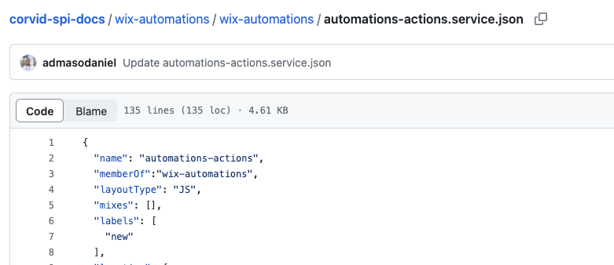
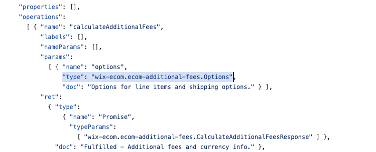

# Velo-SPI-Docs
A JSON model representing [Velo SPIs](https://wix.com/velo/reference/spis)

## How to Update Velo SPI

### Steps:

1. Copy the updated `service.json` from [wix-code-docs]() and replace the corresponding `service.json` in the [corvid-spi-docs](https://github.com/wix-incubator/corvid-spi-docs) repository.
2. Add the `layoutType` field to the `service.json`. For example:
   ```json
   "layoutType": "JS"
   ```
3. Add the `memberOf` field to the `service.json` with the EDM name (usually the folder name). For example:
   ```json
   "memberOf": "wix-ecom"
   ```

Here is an example of how it should look:



4. Add the module prefix to all type paths. For example:
   ```json
   "type": "ecom-additional-fees.Options"
   ```
   should be replaced by:
   ```json
   "type": "wix-ecom.ecom-additional-fees.Options"
   ```



5. Push the changes to a branch and verify with branch preview.
6. Merge the branch into `master`.


