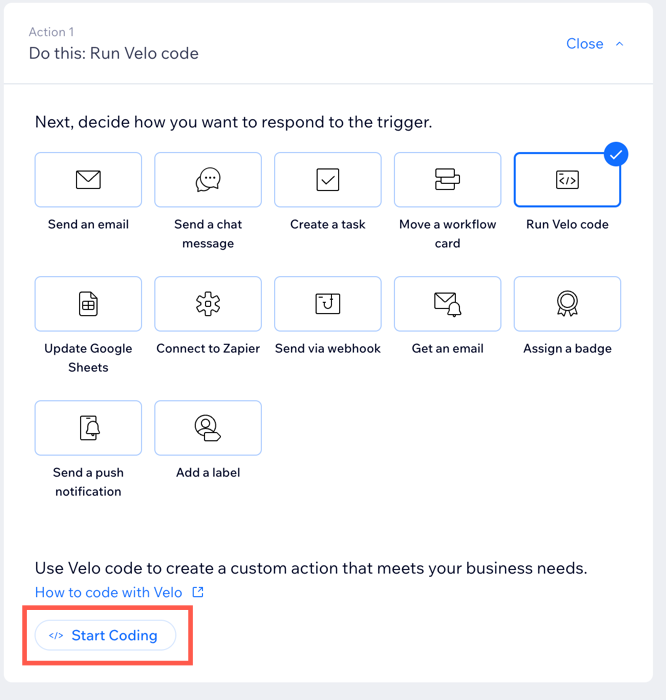
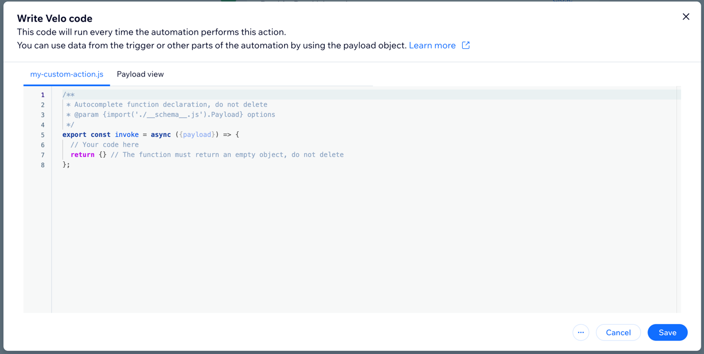

# Implement a custom action in Velo

The Velo Action SPI lets you develop your custom action directly in your site dashboard. Once you create a new automation, you can write your own action code using the **Run Velo Code** feature.

Working directly in the automation allows you to:

+ Easily verify you are working with the correct trigger.
+ View the full trigger payload.
+ Edit sample data provided by Wix and test your code with it.

To write your action code, use the Velo APIs just like you would in your site's public or backend files.

## Before you start

+ Make sure you're familiar with [Wix Automations](https://support.wix.com/en/article/wix-automations-getting-started) and how they
  work on Wix.
+ The custom extensions feature currently can’t be added to a site when using Git integration and Wix CLI.
  You need to have permission to publish the site and the site must be published.
+ This custom extension is intended for site owners who want to create custom actions on a single site. If you're a 3rd-party app   developer interested in becoming an automation provider, see our documentation [here](https://dev.wix.com/docs/rest/api-reference/wix-automations/introduction).

## Create a custom action

To use a custom action as part of an automation, start by creating a new automation in your site dashboard.

1. Go to the [Automations](https://www.wix.com/my-account/site-selector/?buttonText=Select%20Site&title=Select%20a%20Site&autoSelectOnSingleSite=true&actionUrl=https:%2F%2Fwww.wix.com%2Fdashboard%2F%7B%7BmetaSiteId%7D%7D%2Ftriggers) page in your dashboard.
2. Click **New Automation**, then **Start from Scratch**.
3. Select and configure a [trigger](https://support.wix.com/en/article/wix-automations-creating-a-new-automation#step-2-choose-a-trigger).

    <blockquote class="important">

    __Important:__
    The code file you create for your custom action is associated with the original trigger you selected. If you change the trigger,
    a new code file will be created and you'll have to write new code. The initial file you create is still saved, and if you restore
    the trigger it is associated with, you'll be able to access it again in the automation.

    </blockquote>

4. Under **Choose an Action**, select **Run Velo code**. Then click **Start Coding** to add your code.

    

    You'll be prompted to create a new code file.

5. Give the file a name and click **Create & Start Coding**.

    > **Note:**
    > A file is created with the name you give under the **Custom Extensions** tab in your site's backend code.
    Though you can add or edit code in this file, we recommend working only in the file that appears in your
    automation. This allows you to verify you're working with the correct trigger, as well as take advantage of features like testing and payload viewer.

    You should now see something like this:

    

    The **Write Velo Code** modal contains two tabs. The first is the .js file where you write your code. This is a backend file
    that contains a single function, [`invoke()`](velo-action-spi/invoke).
    Write any code that you want the action to execute inside `invoke()`. Do not delete the `return` statement.

    The second tab, which appears under **Payload view**, lets you view the expected structure of the trigger payload. This changes
    depending on the trigger you select. The displayed payload is read-only.

6. When you finish writing your code, click **Save**.

    Now that you have set up and coded your custom action, you can activate the automation immediately. However, we recommend
    testing the action code first.

7. To test your code, follow the instructions under **Run your code to test this action**, then click **Run Code**.

    Wix provides sample data that matches the structure of your trigger payload. You can edit any of the fields in the sample payload
    to test your action.

    Once you test your code and are sure your action works, activate your automation.

## Edit your custom action

To edit your action code, [edit your automation](https://support.wix.com/en/article/wix-automations-managing-your-automations#editing-duplicating-or-renaming-an-automation) and select the **Run Velo code** action, then click on **Edit Code**. Make the changes you want, save the code, and test.
